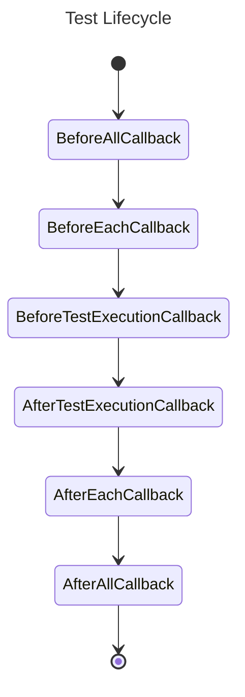

# JUnit5 Extension to observe tests with OpenTelemetry

This [JUnit5](https://junit.org/) extension provides basic (and incomplete) tracing and metrics based on
[OpenTelemetry](https://opentelemetry.io/).

It has been inspired by the [Dynatrace/junit-jupiter-open-telemetry-extension](https://github.com/dynatrace-oss/junit-jupiter-open-telemetry-extension) <!-- markdownlint-disable-line MD013 --> <!-- editorconfig-checker-disable-line -->
project.

## Usage

To build an extension that is locally usable in other projects run:

```shell
./mvnw install
```

You can then use it by adding the following dependency to your project:

```xml
<dependency>
  <groupId>com.nikolasgrottendieck</groupId>
  <artifactId>junit-otel-extension</artifactId>
  <version>0.0.1-SNAPSHOT</version>
  <scope>test</scope>
</dependency>
```

Alternatively, you can use the prebuilt release from GitHub Packages by providing the [necessary authentication information](https://docs.github.com/en/packages/working-with-a-github-packages-registry/working-with-the-apache-maven-registry#authenticating-to-github-packages). <!-- markdownlint-disable-line MD013 --> <!-- editorconfig-checker-disable-line -->

Now annotate your tests with one of the following options:

```java
@ObservedTests // includes tracing & metrics
public class FullObservability() {
  // ...
}

// explicitly includes tracing & metrics
@ExtendWith({OpenTelemetryTracing.class, OpenTelemetryMetrics.class})
public class FullObservability() {
  // ...
}

@ExtendWith(OpenTelemetryTracing.class) // only tracing
public class TracedTest() {
  // ...
}

@ExtendWith(OpenTelemetryMetrics.class) // only metrics
public class MeteredTest() {
  // ...
}
```

This works best with the [automatic](https://opentelemetry.io/docs/languages/java/automatic/) OpenTelemetry
instrumentation provided by the Java Agent:

```xml
<project>
  <!-- ... -->
  <dependencies>
    <dependency>
      <groupId>io.opentelemetry.javaagent</groupId>
      <artifactId>opentelemetry-javaagent</artifactId>
      <version>${opentelemetry-agent.version}</version>
      <scope>provided</scope>
      </dependency>
  </dependencies>
  <!-- ... -->
  <build>
    <plugins>
      <plugin>
        <groupId>org.apache.maven.plugins</groupId>
        <artifactId>maven-dependency-plugin</artifactId>
        <executions>
          <execution>
            <id>copy</id>
            <phase>process-test-classes</phase>
            <goals>
              <goal>copy</goal>
            </goals>
            <configuration>
              <artifactItems>
                <artifactItem>
                  <groupId>io.opentelemetry.javaagent</groupId>
                  <artifactId>opentelemetry-javaagent</artifactId>
                  <overWrite>true</overWrite>
                  <outputDirectory>${project.build.directory}</outputDirectory>
                  <destFileName>otelagent.jar</destFileName>
                </artifactItem>
              </artifactItems>
            </configuration>
          </execution>
        </executions>
      </plugin>
      <!-- ... -->
      <plugin>
        <groupId>org.apache.maven.plugins</groupId>
        <artifactId>maven-surefire-plugin</artifactId>
        <configuration>
          <argLine>-javaagent:${project.build.directory}/otelagent.jar -Dotel.service.name="${project.name}"</argLine>
        </configuration>
      </plugin>
    </plugins>
  </build>
</project>
```

### Configuration

Configure this behavior via either the `.mvn/otel.config` file or `argLine` configuration of `maven-surefire-plugin` in
the `pom.xml`. See [Agent Configuration](https://opentelemetry.io/docs/languages/java/automatic/agent-config/) for
details.

## Example

There is an example implementation in the `example` directory. A `run.sh` is included in case you want to instrument
Maven itself via the [Maven OpenTelemetry extension](https://github.com/open-telemetry/opentelemetry-java-contrib/tree/main/maven-extension). <!-- markdownlint-disable-line MD013 --> <!-- editorconfig-checker-disable-line -->

Please note that you have to add `-javaagent:target/otelagent.jar -Dotel.javaagent.configuration-file=.mvn/otel.config`
to the provided `.mvn/jvm.config` config after running e.g. `./mvnw compile -DskipTests` in order for the agent to be
loaded.

**Important:** Each time you clean the `target` folder you'll have to remove the `-javaagent` parameter from the
`jvm.config` or else Maven will fail during startup!

After you can just invoke `./mvnw test` to generate traces and metrics from the JUnit Extension as well.

## OpenTelemetry Collectors

You can use [SigNoz](https://signoz.io), [HyperDX](https://www.hyperdx.io), [OpenTelemetry Demo](https://opentelemetry.io/docs/demo/) <!-- markdownlint-disable-line MD013 --> <!-- editorconfig-checker-disable-line -->
or any other consumer capable of processing OpenTelemetry data to visualize the results. If you are just interested in
the traces (and not the metrics) you can also use [otel-desktop-viewer](https://github.com/CtrlSpice/otel-desktop-viewer). <!-- markdownlint-disable-line MD013 --> <!-- editorconfig-checker-disable-line -->

## Traces & Metrics

Trace attributes and metrics created by this library are prefixed with `org.junit` as common identifier.

### Attributes and JUnit

What kind of data goes into the trace and metric attributes? There obvious things such as:

- Test arguments
- Test (display|method) name
- Test lifecycle
- Test result (reason)
- Test tag(s)

But also some more possibly non-obvious things that may also influence trace and metric design such as:

- Test type such as a regular `@Test` and other types such as `@ParameterizedTest`, `@RepeatedTest`
- Test method order
- Test class order
- Nesting information ([Span Links](https://opentelemetry.io/docs/concepts/signals/traces/#span-links)!?)
- Timeout data
- Other extensions that have been registered for the test
- Execution Conditions

### Designing Trace Integration

JUnit has so-called [Test Lifecycle Callbacks](https://junit.org/junit5/docs/current/user-guide/#extensions-lifecycle-callbacks) <!-- markdownlint-disable-line MD013 --> <!-- editorconfig-checker-disable-line -->
that we can use for tracing. The general flow looks like this:



To be taken into account are, of course, also the [general definitions](https://junit.org/junit5/docs/current/user-guide/#writing-tests-definitions) <!-- markdownlint-disable-line MD013 --> <!-- editorconfig-checker-disable-line -->
and additional bits and pieces that go into the overall integration of tracing tests to facilitate
accurate representation and information gathering.

For instance, `BeforeAllCallback` and `AfterAllCallback` naturally lend themselves to starting and stopping root-spans.
However, depending on how test instances are configured (`Lifecyle.PER_CLASS`, `Lifecycle.PER_METHOD`) a different setup
via `TestInstancePreConstructCallback` and `TestInstancePreDestroyCallback` make more sense for the overall root-span.

Additionally, while `BeforeTestExecutionCallback` and `AfterTestExecutionCallback` look like very good interfaces for
our use cases there is also the `InvocationInterceptor` interface that allows us to wrap around the actual test
execution and extract more information before and after test execution (such as arguments and results).

A further topic here is granularity. Specifically, when to create new spans in particular or use the option to e.g. add
[events](https://opentelemetry.io/docs/concepts/signals/traces/#span-events) in case a particular thing happened during
testing e.g. the `BeforeEachCallback` was reached or the `AfterEachCallback` was reached.

Beyond that there are various other pieces such as Test Factories, Test Templates and Dynamic Tests that have slightly
different semantics.

#### Test Suites

A [test suite](https://junit.org/junit5/docs/current/user-guide/#junit-platform-suite-engine) is a collection of tests
grouped together and run as a single unit. That is probably something we should reflect when creating spans and traces
for our tests.

### Designing Metrics Integration

For metrics the overall design for _simple_ metrics is very straightforward via the dedicated [Test Result Processing](https://junit.org/junit5/docs/current/user-guide/#extensions-test-result-processing) <!-- markdownlint-disable-line MD013 --> <!-- editorconfig-checker-disable-line -->
interfaces that allow for simple counters such as:

- over all test count
- disabled (skipped) test count
- successful test count
- aborted test count
- failed test count

**TODO**: Investigate whether number of successful/failed assertions and assumptions is possible
